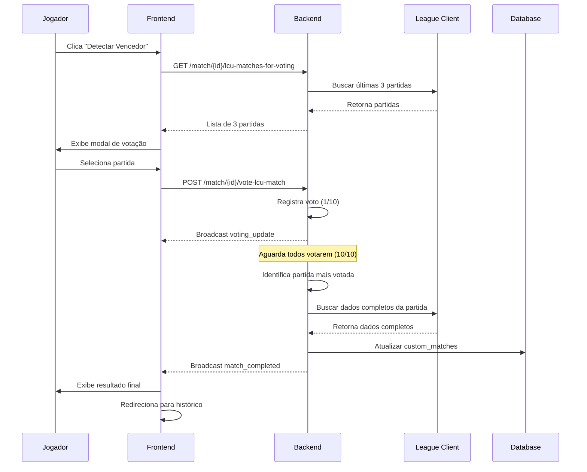

# 📋 Documentação - Finalização de Partida Customizada

## 🎯 Objetivo

Implementar sistema de finalização de partidas customizadas através da vinculação com partidas do LCU (League Client Update), permitindo votação dos jogadores para selecionar a partida correspondente e salvamento completo dos dados no histórico.

---

## 🔄 Fluxo Completo

### 1️⃣ **Tela Game In Progress - Botão "Detectar Vencedor"**

#### Frontend (game-in-progress.ts)

```typescript
// Componente: GameInProgressComponent
// Botão: "Detectar Vencedor"

async detectWinner() {
  // 1. Buscar últimas 3 partidas do jogador atual via LCU
  // 2. Abrir modal de seleção de partida
  // 3. Enviar voto para o backend
  // 4. Aguardar todos os jogadores votarem
  // 5. Backend vincula a partida escolhida
  // 6. Salvar dados completos no banco
}
```

#### Ações

- **Buscar últimas 3 partidas do LCU** do jogador que clicou
  - Endpoint: `GET /api/lcu/match-history/{puuid}?count=3`
  - Filtrar apenas partidas customizadas finalizadas
  - Retornar: `gameId`, `gameMode`, `gameType`, `gameCreation`, `gameDuration`, participantes

- **Abrir Modal de Votação**
  - Componente: `MatchVotingModalComponent` (novo)
  - Exibir 3 partidas com:
    - Data/Hora da partida
    - Duração
    - Resultado (Vitória/Derrota)
    - Composição dos times
  - Botão de seleção para cada partida

- **Enviar Voto**
  - Endpoint: `POST /api/match/{matchId}/vote-lcu-match`
  - Payload: `{ playerId, lcuGameId, timestamp }`

---

### 2️⃣ **Backend - Sistema de Votação**

#### Endpoints Necessários

```java
// DraftController.java ou novo MatchFinalizationController.java

// 1. Buscar últimas partidas LCU
@GetMapping("/match/{matchId}/lcu-matches-for-voting")
public ResponseEntity<Map<String, Object>> getLcuMatchesForVoting(
    @PathVariable Long matchId,
    @RequestParam String playerId
) {
    // Buscar últimas 3 partidas customizadas do LCU
    // Retornar lista de partidas para votação
}

// 2. Registrar voto
@PostMapping("/match/{matchId}/vote-lcu-match")
public ResponseEntity<Map<String, Object>> voteForLcuMatch(
    @PathVariable Long matchId,
    @RequestBody VoteRequest request
) {
    // Registrar voto do jogador
    // Verificar se todos votaram (10/10)
    // Se sim, identificar partida mais votada
    // Vincular partida LCU à partida customizada
}

// 3. Finalizar partida com dados do LCU
@PostMapping("/match/{matchId}/finalize-with-lcu")
public ResponseEntity<Map<String, Object>> finalizeMatchWithLcu(
    @PathVariable Long matchId,
    @RequestBody FinalizeRequest request
) {
    // Buscar dados completos da partida LCU
    // Extrair: vencedor, estatísticas, duração
    // Atualizar custom_matches com dados LCU
    // Salvar riotGameId para vinculação
    // Broadcast match_completed
}
```

#### Lógica de Votação

```java
// MatchVotingService.java (novo)

private Map<Long, Map<String, String>> matchVotes = new ConcurrentHashMap<>();
// Structure: {matchId: {playerId: lcuGameId}}

public void registerVote(Long matchId, String playerId, String lcuGameId) {
    matchVotes.computeIfAbsent(matchId, k -> new ConcurrentHashMap<>())
               .put(playerId, lcuGameId);
    
    // Broadcast atualização de votação
    broadcastVotingUpdate(matchId);
    
    // Verificar se todos votaram
    if (allPlayersVoted(matchId)) {
        String winningGameId = getMostVotedGame(matchId);
        finalizeMatch(matchId, winningGameId);
    }
}

private String getMostVotedGame(Long matchId) {
    Map<String, String> votes = matchVotes.get(matchId);
    // Contar votos e retornar gameId mais votado
    Map<String, Long> voteCounts = votes.values().stream()
        .collect(Collectors.groupingBy(Function.identity(), Collectors.counting()));
    return voteCounts.entrySet().stream()
        .max(Map.Entry.comparingByValue())
        .map(Map.Entry::getKey)
        .orElse(null);
}
```

---

### 3️⃣ **Vinculação e Salvamento**

#### Tabela `custom_matches` - Campos Necessários

```sql
ALTER TABLE custom_matches ADD COLUMN IF NOT EXISTS riot_game_id VARCHAR(255);
ALTER TABLE custom_matches ADD COLUMN IF NOT EXISTS lcu_match_data TEXT; -- JSON completo do LCU
ALTER TABLE custom_matches ADD COLUMN IF NOT EXISTS actual_winner INT; -- Time vencedor real
ALTER TABLE custom_matches ADD COLUMN IF NOT EXISTS actual_duration INT; -- Duração real
ALTER TABLE custom_matches ADD COLUMN IF NOT EXISTS completed_at TIMESTAMP; -- Data/hora finalização
```

#### Salvamento dos Dados

```java
// MatchFinalizationService.java

@Transactional
public void finalizeMatchWithLcuData(Long matchId, String lcuGameId) {
    // 1. Buscar dados completos do LCU
    Map<String, Object> lcuMatch = lcuService.getMatchDetails(lcuGameId);
    
    // 2. Extrair informações importantes
    int winnerTeam = extractWinner(lcuMatch);
    int duration = extractDuration(lcuMatch);
    List<PlayerStats> playerStats = extractPlayerStats(lcuMatch);
    
    // 3. Atualizar custom_matches
    CustomMatch match = customMatchRepository.findById(matchId).orElseThrow();
    match.setRiotGameId(lcuGameId);
    match.setLcuMatchData(objectMapper.writeValueAsString(lcuMatch));
    match.setActualWinner(winnerTeam);
    match.setActualDuration(duration);
    match.setCompletedAt(Instant.now());
    match.setStatus("completed");
    customMatchRepository.save(match);
    
    // 4. Broadcast evento de finalização
    broadcastMatchCompleted(matchId, winnerTeam);
}
```

---

### 4️⃣ **Frontend - Componente de Histórico**

#### Estrutura de Tabs

```typescript
// match-history.component.ts

tabs = [
  { id: 'riot-lcu', label: 'Histórico Riot (LCU)' },
  { id: 'custom', label: 'Partidas Customizadas' }
];

activeTab: string = 'riot-lcu';

// Buscar dados conforme tab ativa
loadMatchHistory() {
  if (this.activeTab === 'riot-lcu') {
    this.loadRiotMatches();
  } else {
    this.loadCustomMatches();
  }
}

loadCustomMatches() {
  this.apiService.getCustomMatches().subscribe(matches => {
    this.customMatches = matches;
  });
}
```

#### Exibição das Partidas Customizadas

```html
<!-- match-history.html -->

<div class="tabs">
  <button [class.active]="activeTab === 'riot-lcu'" 
          (click)="switchTab('riot-lcu')">
    Histórico Riot (LCU)
  </button>
  <button [class.active]="activeTab === 'custom'" 
          (click)="switchTab('custom')">
    Partidas Customizadas
  </button>
</div>

<div *ngIf="activeTab === 'custom'" class="custom-matches">
  <div *ngFor="let match of customMatches" class="match-card">
    <!-- Exibir dados da partida customizada -->
    <div class="match-header">
      <span>{{ match.createdAt | date:'dd/MM/yyyy HH:mm' }}</span>
      <span class="duration">{{ formatDuration(match.actualDuration) }}</span>
      <span [class]="match.actualWinner === 1 ? 'win' : 'loss'">
        {{ match.actualWinner === 1 ? 'VITÓRIA' : 'DERROTA' }}
      </span>
    </div>
    
    <!-- Times e estatísticas -->
    <div class="teams">
      <!-- Exibir team1 e team2 com champions e stats -->
    </div>
    
    <!-- Link para partida do Riot -->
    <div *ngIf="match.riotGameId" class="riot-link">
      🔗 Vinculada à partida Riot: {{ match.riotGameId }}
    </div>
  </div>
</div>
```

---

### 5️⃣ **Botão de Teste - Simular Última Partida**

#### Local: Tela de Configuração (app-simple ou settings)

```typescript
// settings.component.ts ou app-simple.ts

async simulateLastMatch() {
  try {
    console.log('🎮 Simulando última partida do LCU...');
    
    // 1. Buscar última partida customizada do LCU
    const lastMatch = await firstValueFrom(
      this.apiService.getLastLcuMatch()
    );
    
    if (!lastMatch) {
      alert('Nenhuma partida encontrada no LCU');
      return;
    }
    
    // 2. Enviar para backend simular como partida customizada
    const response = await firstValueFrom(
      this.apiService.simulateCustomMatch(lastMatch)
    );
    
    if (response.success) {
      alert('Partida simulada com sucesso! ID: ' + response.matchId);
      console.log('✅ Partida simulada:', response);
    }
  } catch (error) {
    console.error('❌ Erro ao simular partida:', error);
    alert('Erro ao simular partida');
  }
}
```

#### Backend - Endpoint de Simulação

```java
// TestController.java ou DebugController.java

@PostMapping("/api/debug/simulate-last-match")
public ResponseEntity<Map<String, Object>> simulateLastMatch(
    @RequestBody Map<String, Object> lcuMatchData
) {
    try {
        // 1. Criar uma custom_match com dados do LCU
        CustomMatch simulatedMatch = new CustomMatch();
        simulatedMatch.setTitle("Partida Simulada - " + LocalDateTime.now());
        simulatedMatch.setStatus("completed");
        simulatedMatch.setRiotGameId((String) lcuMatchData.get("gameId"));
        simulatedMatch.setLcuMatchData(objectMapper.writeValueAsString(lcuMatchData));
        
        // 2. Extrair dados dos times
        List<Map<String, Object>> participants = 
            (List<Map<String, Object>>) lcuMatchData.get("participants");
        
        List<Map<String, Object>> team1 = participants.subList(0, 5);
        List<Map<String, Object>> team2 = participants.subList(5, 10);
        
        simulatedMatch.setTeam1PlayersJson(objectMapper.writeValueAsString(team1));
        simulatedMatch.setTeam2PlayersJson(objectMapper.writeValueAsString(team2));
        
        // 3. Identificar vencedor
        int winnerTeam = extractWinnerFromLcuData(lcuMatchData);
        simulatedMatch.setActualWinner(winnerTeam);
        
        // 4. Duração
        int duration = (int) lcuMatchData.get("gameDuration");
        simulatedMatch.setActualDuration(duration);
        
        // 5. Salvar
        simulatedMatch.setCreatedAt(Instant.now());
        simulatedMatch.setCompletedAt(Instant.now());
        CustomMatch saved = customMatchRepository.save(simulatedMatch);
        
        return ResponseEntity.ok(Map.of(
            "success", true,
            "matchId", saved.getId(),
            "message", "Partida simulada com sucesso"
        ));
        
    } catch (Exception e) {
        log.error("Erro ao simular partida", e);
        return ResponseEntity.status(500).body(Map.of(
            "success", false,
            "error", e.getMessage()
        ));
    }
}
```

---

## 📊 Fluxo de Dados Completo



---

## 🧪 Teste Completo

### Passo a Passo para Testar

1. **Preparação**
   - Jogar algumas partidas customizadas no LoL
   - Garantir que o LCU está conectado

2. **Simulação de Partida**
   - Ir para tela de Configuração
   - Clicar em "Simular Última Partida"
   - Verificar se partida aparece no histórico customizado

3. **Teste de Vinculação Real**
   - Iniciar matchmaking customizado
   - Completar draft
   - Entrar no "Game In Progress"
   - Jogar a partida no LoL
   - Clicar em "Detectar Vencedor"
   - Todos os jogadores votam
   - Verificar se dados são salvos corretamente

4. **Verificação no Histórico**
   - Abrir aba "Partidas Customizadas"
   - Verificar se partida aparece com:
     - ✅ Data/Hora corretas
     - ✅ Vencedor correto
     - ✅ Duração correta
     - ✅ Composição dos times
     - ✅ Link para partida Riot

---

## 📁 Arquivos a Criar/Modificar

### Novos Arquivos

- `frontend/src/app/components/match-voting-modal/match-voting-modal.ts`
- `frontend/src/app/components/match-voting-modal/match-voting-modal.html`
- `frontend/src/app/components/match-voting-modal/match-voting-modal.scss`
- `src/main/java/br/com/lolmatchmaking/backend/service/MatchVotingService.java`
- `src/main/java/br/com/lolmatchmaking/backend/service/MatchFinalizationService.java`
- `src/main/java/br/com/lolmatchmaking/backend/controller/MatchFinalizationController.java`

### Arquivos a Modificar

- `frontend/src/app/components/game-in-progress/game-in-progress.ts` - Adicionar botão "Detectar Vencedor"
- `frontend/src/app/components/game-in-progress/game-in-progress.html` - UI do botão
- `frontend/src/app/components/match-history/match-history.ts` - Adicionar tab customizadas
- `frontend/src/app/components/match-history/match-history.html` - UI das tabs
- `frontend/src/app/services/api.ts` - Novos endpoints
- `src/main/resources/db/migration/` - Migration para novos campos

---

## ✅ Checklist de Implementação

- [ ] Backend: Criar MatchVotingService
- [ ] Backend: Criar MatchFinalizationService
- [ ] Backend: Criar MatchFinalizationController com endpoints
- [ ] Backend: Migration para adicionar campos no custom_matches
- [ ] Backend: Endpoint de simulação de partida
- [ ] Frontend: Criar MatchVotingModalComponent
- [ ] Frontend: Adicionar botão "Detectar Vencedor" no GameInProgress
- [ ] Frontend: Adicionar tab "Partidas Customizadas" no histórico
- [ ] Frontend: Implementar exibição de partidas customizadas
- [ ] Frontend: Adicionar botão "Simular Última Partida" nas configurações
- [ ] Frontend: Novos métodos no ApiService
- [ ] Testes: Simular partida
- [ ] Testes: Votação completa
- [ ] Testes: Verificar histórico

---

**Pronto para começar a implementação?** 🚀
