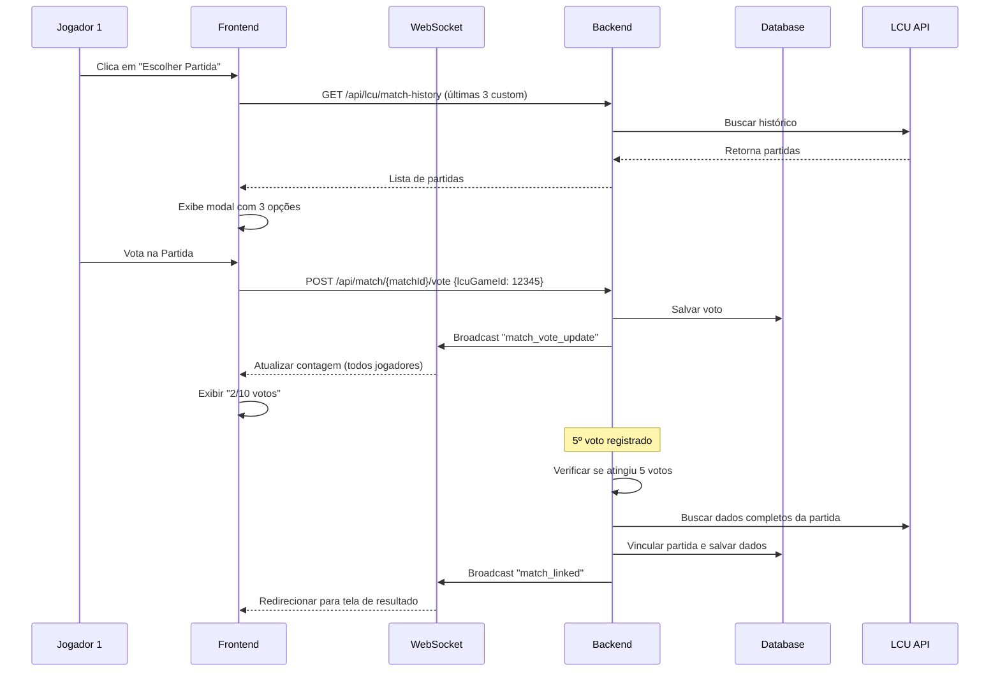

# 📋 Análise: Sistema de Votação de Partidas LCU

## 🎯 Objetivo

Substituir o sistema de "declarar vencedor" por um sistema de **votação de partidas do LCU**, onde:

1. Os jogadores escolhem qual partida do histórico do LCU corresponde à partida atual
2. A partida que receber 5+ votos é vinculada automaticamente
3. Todos os dados da partida do LCU são salvos no banco de dados
4. Os dados são exibidos no histórico de partidas customizadas

---

## 📊 Estado Atual

### ✅ O que já existe

#### 1. **Modal de Seleção de Partidas** (`winner-confirmation-modal`)

- ✅ Exibe lista de partidas customizadas do LCU
- ✅ Mostra informações básicas (data, duração, times, vencedor)
- ✅ Permite seleção de uma partida
- ✅ Identifica jogadores da partida atual em cada opção
- ✅ Confirma a seleção e retorna a partida escolhida

**Localização:**

- `frontend/src/app/components/winner-confirmation-modal/winner-confirmation-modal.component.ts`
- `frontend/src/app/components/winner-confirmation-modal/winner-confirmation-modal.component.html`

#### 2. **Busca de Histórico do LCU**

- ✅ Endpoint funcionando: `getLCUMatchHistoryAll(offset, limit, includePickBan)`
- ✅ Filtragem de partidas customizadas (queueId === 0)
- ✅ Retorna últimas 3 partidas personalizadas

**Método atual em `game-in-progress.ts`:**

```typescript
async retryAutoDetection() {
  this.isAutoDetecting = true;
  const historyResponse = await firstValueFrom(
    this.apiService.getLCUMatchHistoryAll(0, 50, false)
  );
  
  // Filtrar apenas partidas personalizadas
  const customMatches = historyResponse.matches.filter((match: any) =>
    match.queueId === 0 || match.gameType === 'CUSTOM_GAME'
  );
  
  // Pegar últimas 3
  const last3CustomMatches = customMatches.slice(0, 3);
  
  // Abrir modal
  this.customMatchesForConfirmation = last3CustomMatches;
  this.showWinnerConfirmationModal = true;
  this.isAutoDetecting = false;
}
```

#### 3. **Callback de Confirmação**

```typescript
onWinnerConfirmed(data: { match: any, winner: 'blue' | 'red' }) {
  this.showWinnerConfirmationModal = false;
  this.autoCompleteGameWithRealData(data.winner, true, data.match);
}
```

---

## ❌ O que está faltando

### 1. **Sistema de Votação (Ausente)**

❌ Não há sistema de votação implementado
❌ Atualmente, qualquer jogador pode escolher a partida diretamente
❌ Não há contagem de votos
❌ Não há sincronização entre jogadores via WebSocket

### 2. **Backend: Endpoints de Votação**

❌ Não há endpoint para registrar voto em uma partida
❌ Não há endpoint para consultar votos atuais
❌ Não há lógica de vinculação automática ao atingir 5 votos

### 3. **Frontend: Interface de Votação**

❌ O modal atual não mostra votação, apenas seleção direta
❌ Não exibe contagem de votos em tempo real
❌ Não mostra quais jogadores já votaram

### 4. **WebSocket: Eventos de Votação**

❌ Não há evento `match_vote_cast` (jogador votou)
❌ Não há evento `match_vote_update` (atualizar contagem)
❌ Não há evento `match_linked` (partida vinculada automaticamente)

### 5. **Banco de Dados: Estrutura de Votação**

❌ Não há tabela ou campo para armazenar votos
❌ Não há campo para armazenar qual partida do LCU foi vinculada

### 6. **Funcionalidades Adicionais**

❌ Botão "Carregar Mais Partidas" não implementado
❌ Botão "Atualizar Lista" não implementado
❌ Exibição de dados completos do LCU no histórico não implementada

---

## 🏗️ Arquitetura Proposta

### **Fluxo de Votação**



---

## 🔧 Implementação Necessária

### **1. Backend (Spring Boot)**

#### 1.1 Entidade de Votação

```java
@Entity
@Table(name = "match_votes")
public class MatchVote {
    @Id
    @GeneratedValue(strategy = GenerationType.IDENTITY)
    private Long id;
    
    @Column(name = "match_id")
    private Long matchId;
    
    @Column(name = "player_id")
    private Long playerId;
    
    @Column(name = "lcu_game_id")
    private Long lcuGameId;
    
    @Column(name = "voted_at")
    private LocalDateTime votedAt;
}
```

#### 1.2 Adicionar campo em `Match`

```java
@Entity
@Table(name = "matches")
public class Match {
    // ... campos existentes ...
    
    @Column(name = "linked_lcu_game_id")
    private Long linkedLcuGameId;
    
    @Column(name = "lcu_match_data", columnDefinition = "TEXT")
    private String lcuMatchData; // JSON completo da partida
}
```

#### 1.3 Endpoints REST

```java
@RestController
@RequestMapping("/api/match")
public class MatchVoteController {
    
    // Registrar voto
    @PostMapping("/{matchId}/vote")
    public ResponseEntity<?> voteForMatch(
        @PathVariable Long matchId,
        @RequestBody VoteRequest request
    ) {
        // 1. Validar se jogador está na partida
        // 2. Salvar voto (substituir se já votou)
        // 3. Contar votos totais
        // 4. Se >= 5 votos: vincular automaticamente
        // 5. Broadcast via WebSocket
    }
    
    // Consultar votos atuais
    @GetMapping("/{matchId}/votes")
    public ResponseEntity<?> getMatchVotes(@PathVariable Long matchId) {
        // Retornar lista de votos com contagem por partida
    }
    
    // Vincular partida manualmente (fallback admin)
    @PostMapping("/{matchId}/link")
    public ResponseEntity<?> linkMatch(
        @PathVariable Long matchId,
        @RequestBody LinkRequest request
    ) {
        // Vincular partida do LCU e salvar dados completos
    }
}
```

#### 1.4 Lógica de Vinculação Automática

```java
@Service
public class MatchVoteService {
    
    public void processVote(Long matchId, Long playerId, Long lcuGameId) {
        // 1. Salvar/atualizar voto
        MatchVote vote = new MatchVote();
        vote.setMatchId(matchId);
        vote.setPlayerId(playerId);
        vote.setLcuGameId(lcuGameId);
        matchVoteRepository.save(vote);
        
        // 2. Contar votos
        Map<Long, Long> voteCount = countVotesByLcuGameId(matchId);
        
        // 3. Broadcast atualização
        webSocketService.broadcastToMatch(matchId, 
            "match_vote_update", voteCount);
        
        // 4. Verificar se alguma partida atingiu 5 votos
        Optional<Long> winnerLcuGameId = voteCount.entrySet().stream()
            .filter(e -> e.getValue() >= 5)
            .map(Map.Entry::getKey)
            .findFirst();
        
        if (winnerLcuGameId.isPresent()) {
            linkMatchAutomatically(matchId, winnerLcuGameId.get());
        }
    }
    
    private void linkMatchAutomatically(Long matchId, Long lcuGameId) {
        // 1. Buscar dados completos da partida do LCU
        LcuMatchDetails details = lcuService.getMatchDetails(lcuGameId);
        
        // 2. Atualizar Match no banco
        Match match = matchRepository.findById(matchId).orElseThrow();
        match.setLinkedLcuGameId(lcuGameId);
        match.setLcuMatchData(objectMapper.writeValueAsString(details));
        
        // 3. Detectar vencedor
        String winner = detectWinnerFromLcuData(details);
        match.setWinner(winner);
        match.setStatus("COMPLETED");
        
        matchRepository.save(match);
        
        // 4. Broadcast conclusão
        webSocketService.broadcastToMatch(matchId, 
            "match_linked", 
            Map.of("lcuGameId", lcuGameId, "winner", winner));
    }
}
```

---

### **2. Frontend (Angular)**

#### 2.1 Modificar `winner-confirmation-modal.component.ts`

```typescript
export class WinnerConfirmationModalComponent implements OnInit {
    @Input() customMatches: CustomMatch[] = [];
    @Input() currentPlayers: any[] = [];
    @Input() currentMatchId: number; // ID da partida atual
    @Input() currentPlayerId: number; // ID do jogador atual
    @Output() onVote = new EventEmitter<{ lcuGameId: number }>();
    @Output() onCancel = new EventEmitter<void>();
    
    matchOptions: MatchOption[] = [];
    votesByMatch: Map<number, number> = new Map(); // lcuGameId -> vote count
    playerVote: number | null = null; // lcuGameId que o jogador votou
    isLoading = false;
    
    ngOnInit() {
        this.processMatches();
        this.subscribeToVoteUpdates();
    }
    
    private subscribeToVoteUpdates() {
        // Escutar eventos de votação via WebSocket
        this.webSocketService.on('match_vote_update', (data: any) => {
            this.votesByMatch = new Map(Object.entries(data.votes));
        });
        
        this.webSocketService.on('match_linked', (data: any) => {
            // Partida vinculada! Fechar modal e exibir resultado
            this.onCancel.emit();
            this.showSuccessNotification(
                `Partida vinculada! Vencedor: ${data.winner}`
            );
        });
    }
    
    voteForMatch(lcuGameId: number) {
        if (this.playerVote === lcuGameId) {
            // Remover voto
            this.apiService.removeVote(this.currentMatchId).subscribe();
            this.playerVote = null;
        } else {
            // Votar
            this.onVote.emit({ lcuGameId });
            this.playerVote = lcuGameId;
        }
    }
    
    getVoteCount(lcuGameId: number): number {
        return this.votesByMatch.get(lcuGameId) || 0;
    }
    
    hasPlayerVoted(lcuGameId: number): boolean {
        return this.playerVote === lcuGameId;
    }
}
```

#### 2.2 Modificar Template HTML

```html
<div class="matches-list">
    <div *ngFor="let option of matchOptions; let i = index"
         class="match-card"
         [class.voted]="hasPlayerVoted(option.match.gameId)"
         [class.has-majority]="getVoteCount(option.match.gameId) >= 5">
        
        <!-- Header com informações da partida -->
        <div class="match-header">
            <span class="match-number">Partida #{{i + 1}}</span>
            <span class="match-time">{{ option.formattedDate }}</span>
            <span class="match-duration">⏱️ {{ option.formattedDuration }}</span>
        </div>
        
        <!-- Informações de votação -->
        <div class="vote-info">
            <div class="vote-count">
                <span class="vote-icon">🗳️</span>
                <span class="vote-text">
                    {{ getVoteCount(option.match.gameId) }}/10 votos
                </span>
            </div>
            
            <div class="vote-progress-bar">
                <div class="progress-fill" 
                     [style.width.%]="(getVoteCount(option.match.gameId) / 10) * 100">
                </div>
            </div>
            
            <span class="player-vote-badge" *ngIf="hasPlayerVoted(option.match.gameId)">
                ✓ Você votou aqui
            </span>
        </div>
        
        <!-- Vencedor -->
        <div class="winner-badge" *ngIf="option.winningTeam">
            Vencedor: {{ option.winningTeam === 'blue' ? 'Time Azul' : 'Time Vermelho' }}
        </div>
        
        <!-- Times -->
        <div class="match-teams">
            <!-- ... conteúdo existente ... -->
        </div>
        
        <!-- Botão de votar -->
        <button class="btn-vote" 
                [class.btn-voted]="hasPlayerVoted(option.match.gameId)"
                (click)="voteForMatch(option.match.gameId)">
            <span *ngIf="!hasPlayerVoted(option.match.gameId)">
                🗳️ Votar nesta partida
            </span>
            <span *ngIf="hasPlayerVoted(option.match.gameId)">
                ✓ Remover voto
            </span>
        </button>
    </div>
</div>

<!-- Botões adicionais -->
<div class="modal-actions">
    <button class="btn btn-outline" (click)="loadMoreMatches()">
        Carregar Mais Partidas
    </button>
    
    <button class="btn btn-outline" (click)="refreshMatches()">
        🔄 Atualizar Lista
    </button>
    
    <button class="btn btn-secondary" (click)="onCancel.emit()">
        Cancelar
    </button>
</div>
```

#### 2.3 Modificar `game-in-progress.component.ts`

```typescript
onVote(data: { lcuGameId: number }) {
    this.apiService.voteForMatch(this.gameData.matchId, data.lcuGameId)
        .subscribe({
            next: (response) => {
                console.log('✅ Voto registrado:', response);
            },
            error: (error) => {
                console.error('❌ Erro ao votar:', error);
                alert('Erro ao registrar voto.');
            }
        });
}
```

#### 2.4 Adicionar Métodos ao `ApiService`

```typescript
// api.service.ts
voteForMatch(matchId: number, lcuGameId: number): Observable<any> {
    return this.http.post(`/api/match/${matchId}/vote`, { lcuGameId });
}

removeVote(matchId: number): Observable<any> {
    return this.http.delete(`/api/match/${matchId}/vote`);
}

getMatchVotes(matchId: number): Observable<any> {
    return this.http.get(`/api/match/${matchId}/votes`);
}
```

---

### **3. WebSocket**

#### 3.1 Novos Eventos

```java
// WebSocketEventType.java
public enum WebSocketEventType {
    // ... eventos existentes ...
    MATCH_VOTE_UPDATE,      // Atualizar contagem de votos
    MATCH_LINKED,           // Partida vinculada automaticamente
}
```

#### 3.2 Broadcasts

```java
// Quando voto é registrado
webSocketService.sendToMatch(matchId, new WebSocketMessage(
    WebSocketEventType.MATCH_VOTE_UPDATE,
    Map.of(
        "votes", voteCountByLcuGameId,
        "total", totalVotes
    )
));

// Quando partida é vinculada
webSocketService.sendToMatch(matchId, new WebSocketMessage(
    WebSocketEventType.MATCH_LINKED,
    Map.of(
        "lcuGameId", linkedLcuGameId,
        "winner", winner,
        "message", "Partida vinculada com sucesso!"
    )
));
```

---

### **4. Banco de Dados**

#### 4.1 Migrations SQL

```sql
-- V8__add_match_voting.sql

-- Tabela de votos
CREATE TABLE match_votes (
    id BIGSERIAL PRIMARY KEY,
    match_id BIGINT NOT NULL,
    player_id BIGINT NOT NULL,
    lcu_game_id BIGINT NOT NULL,
    voted_at TIMESTAMP DEFAULT CURRENT_TIMESTAMP,
    CONSTRAINT fk_match_votes_match FOREIGN KEY (match_id) 
        REFERENCES matches(id) ON DELETE CASCADE,
    CONSTRAINT fk_match_votes_player FOREIGN KEY (player_id) 
        REFERENCES players(id) ON DELETE CASCADE,
    CONSTRAINT unique_player_vote_per_match UNIQUE (match_id, player_id)
);

-- Adicionar campos em matches
ALTER TABLE matches 
    ADD COLUMN linked_lcu_game_id BIGINT,
    ADD COLUMN lcu_match_data TEXT;

-- Índices
CREATE INDEX idx_match_votes_match_id ON match_votes(match_id);
CREATE INDEX idx_match_votes_player_id ON match_votes(player_id);
CREATE INDEX idx_match_votes_lcu_game_id ON match_votes(lcu_game_id);
```

---

## 📝 Checklist de Implementação

### Backend

- [ ] Criar entidade `MatchVote`
- [ ] Adicionar campos `linked_lcu_game_id` e `lcu_match_data` em `Match`
- [ ] Criar repository `MatchVoteRepository`
- [ ] Criar service `MatchVoteService`
- [ ] Criar controller `MatchVoteController` com endpoints:
  - [ ] `POST /api/match/{matchId}/vote`
  - [ ] `DELETE /api/match/{matchId}/vote`
  - [ ] `GET /api/match/{matchId}/votes`
- [ ] Implementar lógica de vinculação automática ao atingir 5 votos
- [ ] Adicionar eventos WebSocket:
  - [ ] `MATCH_VOTE_UPDATE`
  - [ ] `MATCH_LINKED`
- [ ] Criar migration SQL

### Frontend

- [ ] Modificar `winner-confirmation-modal.component.ts`:
  - [ ] Adicionar sistema de votação
  - [ ] Adicionar contadores de votos
  - [ ] Adicionar subscription a eventos WebSocket
  - [ ] Implementar `voteForMatch()`
  - [ ] Implementar `loadMoreMatches()`
  - [ ] Implementar `refreshMatches()`
- [ ] Modificar template do modal:
  - [ ] Adicionar UI de votação
  - [ ] Adicionar contador de votos
  - [ ] Adicionar barra de progresso
  - [ ] Adicionar botões "Carregar Mais" e "Atualizar"
- [ ] Modificar `game-in-progress.component.ts`:
  - [ ] Substituir callback direto por votação
  - [ ] Remover seção "Declarar Vencedor" do HTML
  - [ ] Substituir por botão "Escolher Partida"
- [ ] Adicionar métodos ao `ApiService`:
  - [ ] `voteForMatch()`
  - [ ] `removeVote()`
  - [ ] `getMatchVotes()`
- [ ] Adicionar handlers WebSocket para:
  - [ ] `match_vote_update`
  - [ ] `match_linked`

### Histórico de Partidas

- [ ] Modificar exibição de partidas customizadas para incluir dados do LCU
- [ ] Exibir informações detalhadas como no histórico LCU:
  - [ ] KDA de cada jogador
  - [ ] Gold, CS, dano
  - [ ] Itens finais
  - [ ] Runas
  - [ ] Feitiços de invocador

### Testes

- [ ] Testar votação com múltiplos jogadores
- [ ] Testar vinculação automática ao atingir 5 votos
- [ ] Testar sincronização via WebSocket
- [ ] Testar carregamento de mais partidas
- [ ] Testar exibição de dados no histórico

---

## 🎨 Melhorias de UX Sugeridas

1. **Indicador Visual**: Mostrar qual partida está "liderando" com uma borda colorida
2. **Animação**: Quando uma partida atinge 5 votos, animar a transição
3. **Notificação**: Toast notification quando partida é vinculada
4. **Auto-refresh**: Atualizar lista automaticamente a cada 30s
5. **Feedback**: Mostrar loading ao carregar mais partidas
6. **Validação**: Não permitir votar em partidas muito antigas (> 1 hora)

---

## 🚀 Ordem de Implementação Recomendada

1. **Backend: Estrutura base**
   - Criar entidade, repository, service
   - Implementar endpoints básicos
   - Criar migration

2. **Backend: Lógica de votação**
   - Implementar contagem de votos
   - Implementar vinculação automática
   - Adicionar eventos WebSocket

3. **Frontend: Adaptar modal**
   - Adicionar UI de votação
   - Implementar comunicação com API
   - Adicionar subscription WebSocket

4. **Frontend: Modificar game-in-progress**
   - Substituir declaração direta por votação
   - Ajustar callbacks

5. **Frontend: Histórico**
   - Exibir dados completos do LCU

6. **Testes e refinamentos**
   - Testar fluxo completo
   - Ajustar UX
   - Corrigir bugs

---

## 📌 Considerações Importantes

### Segurança

- ✅ Validar se jogador pertence à partida antes de aceitar voto
- ✅ Prevenir spam de votos (rate limiting)
- ✅ Garantir que cada jogador vota apenas uma vez

### Performance

- ✅ Usar índices no banco para consultas rápidas
- ✅ Cachear lista de partidas do LCU
- ✅ Limitar número de partidas carregadas por vez

### Edge Cases

- ❓ E se ninguém votar? → Manter sistema de declaração manual como fallback
- ❓ E se houver empate? → Primeira partida a atingir 5 votos vence
- ❓ E se a partida não estiver no histórico? → Botão "Carregar Mais"
- ❓ E se jogador votar errado? → Permitir mudança de voto

---

## 📖 Resumo

**Status Atual:**

- ✅ Modal de seleção existe mas sem votação
- ✅ Busca de histórico do LCU funciona
- ❌ Sistema de votação não existe
- ❌ Sincronização entre jogadores não existe
- ❌ Vinculação automática não existe

**Próximos Passos:**

1. Criar estrutura de votação no backend
2. Implementar endpoints REST de votação
3. Adicionar eventos WebSocket
4. Adaptar modal para sistema de votação
5. Testar fluxo completo com múltiplos jogadores

---

**Estimativa de Tempo:** 6-8 horas de desenvolvimento
**Complexidade:** Média-Alta
**Prioridade:** Alta (funcionalidade core do sistema)
